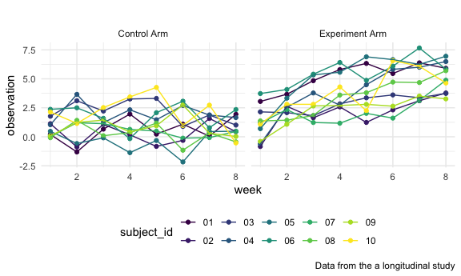

HW5\_gc2942
================

## Problem 1

``` r
homicide_df = read.csv("./homicide-data.csv",na=c("","Unknown")) %>% 
  mutate(city_state = str_c(city,state),
  resolution =  case_when(disposition == "Closed without arrest"~"unsolved",
            disposition =="Open/No arrest"~"unsolved",
            disposition =="Closed by arrest"~"solved")) %>% 
  relocate(city_state) %>% 
  filter(city_state!= "TulsaAL")
```

``` r
baltimore_df = 
  homicide_df %>% 
  filter(city_state == "BaltimoreMD")

baltimore_summary = 
  baltimore_df %>% 
  summarize(
    unsolved = sum(resolution == "unsolved"),
    n = n())

baltimore_test = 
  prop.test(
  x = baltimore_summary %>% pull(unsolved),
  n = baltimore_summary %>% pull(n))


baltimore_test %>% 
  broom::tidy()
```

    ## # A tibble: 1 × 8
    ##   estimate statistic  p.value parameter conf.low conf.high method    alternative
    ##      <dbl>     <dbl>    <dbl>     <int>    <dbl>     <dbl> <chr>     <chr>      
    ## 1    0.646      239. 6.46e-54         1    0.628     0.663 1-sample… two.sided

``` r
prop_test_function = function(city_df){
    city_summary = city_df %>% 
    summarize(
      unsolved = sum(resolution == "unsolved"),
      n = n())
  city_test = 
  prop.test(
  x = city_summary %>% pull(unsolved),
  n = city_summary %>% pull(n))
  
  return(city_test)
}


prop_test_function(baltimore_df)
```

    ## 
    ##  1-sample proportions test with continuity correction
    ## 
    ## data:  city_summary %>% pull(unsolved) out of city_summary %>% pull(n), null probability 0.5
    ## X-squared = 239.01, df = 1, p-value < 2.2e-16
    ## alternative hypothesis: true p is not equal to 0.5
    ## 95 percent confidence interval:
    ##  0.6275625 0.6631599
    ## sample estimates:
    ##         p 
    ## 0.6455607

``` r
homicide_df %>% 
  filter(city_state=="AlbuquerqueNM") %>% 
  prop_test_function()
```

    ## 
    ##  1-sample proportions test with continuity correction
    ## 
    ## data:  city_summary %>% pull(unsolved) out of city_summary %>% pull(n), null probability 0.5
    ## X-squared = 19.114, df = 1, p-value = 1.232e-05
    ## alternative hypothesis: true p is not equal to 0.5
    ## 95 percent confidence interval:
    ##  0.3372604 0.4375766
    ## sample estimates:
    ##         p 
    ## 0.3862434

Now, let’s iterate across all cities.

``` r
results_df=homicide_df %>% 
  nest(data = uid:resolution) %>% 
  mutate(test_results = map(data,prop_test_function),
         tidy_results = map(test_results, broom::tidy)) %>% 
  select(city_state,tidy_results) %>% 
  unnest(tidy_results) %>% 
  select(city_state,estimate,starts_with("conf"))
```

``` r
results_df %>% 
  mutate(city_state = fct_reorder(city_state, estimate)) %>% 
  ggplot(aes(x= city_state,y=estimate))+
  geom_point()+
  geom_errorbar(aes(ymin=conf.low,ymax=conf.high))+
  theme(axis.text.x = element_text(angle=90,vjust=0.5,hjust=1))
```


Alternative way..

``` r
homicide_df %>% 
  group_by(city_state) %>% 
  summarize(unsolved = sum (resolution =="unsolved"),
            n=n()) %>% 
  mutate(
    test_results = map2(unsolved,n,prop.test),
    tidy_results = map(test_results, broom::tidy)) %>% 
  select(city_state,tidy_results) %>% 
  unnest(tidy_results) %>% 
  select(city_state,estimate,starts_with("conf"))
```

    ## # A tibble: 50 × 4
    ##    city_state    estimate conf.low conf.high
    ##    <chr>            <dbl>    <dbl>     <dbl>
    ##  1 AlbuquerqueNM    0.386    0.337     0.438
    ##  2 AtlantaGA        0.383    0.353     0.415
    ##  3 BaltimoreMD      0.646    0.628     0.663
    ##  4 Baton RougeLA    0.462    0.414     0.511
    ##  5 BirminghamAL     0.434    0.399     0.469
    ##  6 BostonMA         0.505    0.465     0.545
    ##  7 BuffaloNY        0.612    0.569     0.654
    ##  8 CharlotteNC      0.300    0.266     0.336
    ##  9 ChicagoIL        0.736    0.724     0.747
    ## 10 CincinnatiOH     0.445    0.408     0.483
    ## # … with 40 more rows

## Problem 2

Create a dataframe, import data by iterating over file names and read in
data for each subject.

``` r
file_df = 
  tibble(
    file =list.files("./data") ,
    vec_file = str_c("./data/",file)) %>% 
  mutate(group = map(vec_file, read.csv)) %>% 
  unnest()
```

Tidy the result– manipulate file names to include control arm and
subject ID.

``` r
tidy_df=file_df %>% 
  select(-vec_file) %>% 
  pivot_longer(week_1:week_8,
               names_to = "week",
               values_to = "observation") %>% 
 separate(file,c("arm","subject_id"),"_") %>% 
 mutate(arm = case_when(arm == "con"~"Control Arm",
                        arm == "exp"~"Experiment Arm"),
         subject_id=str_replace(subject_id,".csv",""),
         week = as.integer(str_replace(week,"week_","")),
         arm =as.factor(arm))
```

Make a spaghetti plot showing observations on each subject over time

``` r
tidy_df %>% 
  ggplot(aes(x = week, y = observation, color = subject_id)) + 
  geom_point() + 
  geom_line()+
  facet_grid(.~arm)+
  labs(title = "",
       x="week",
       y="observation",
       caption ="Data from the a longitudinal study")
```

 The
observation value in the experiment arm is larger than the value in the
control arm.

## Problem 3

``` r
library(tidyverse)

set.seed(10)

iris_with_missing = iris %>% 
  map_df(~replace(.x, sample(1:150, 20), NA)) %>%
  mutate(Species = as.character(Species))
```

I fill in missing values with the mean of non-missing values for numeric
variables, and fill in missing values with “virginica” for character
variables.

``` r
fill_in_missing = function(x){
  if (is.numeric(x)){
    x=replace(x,is.na(x),mean(x,na.rm=TRUE))
  } 
  if (is.character(x)){
     x=replace(x,is.na(x), "virginica") 
  }
  return(x)
}
```

``` r
output = map_df(iris_with_missing,fill_in_missing)
```
